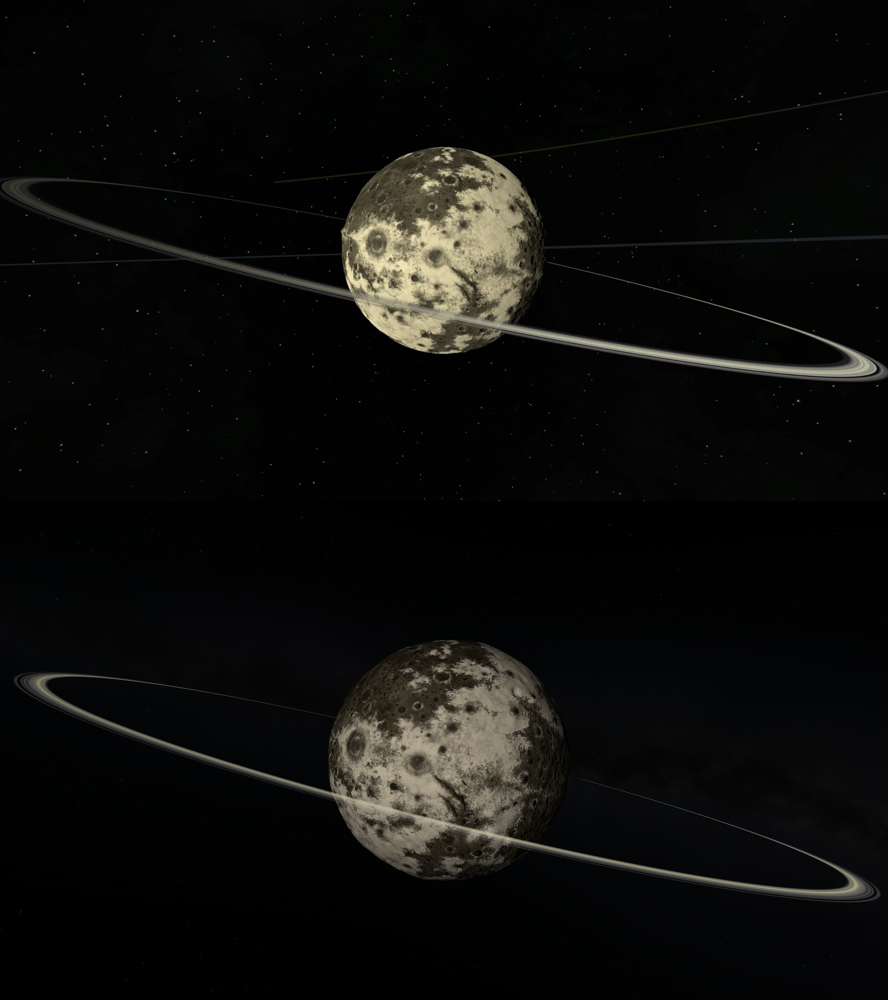

# Reclaim KSP - Dres

This mod ~~replaces~~ adds Dres, the urban legend referenced in KSP memes, based on testimony from the victims of the mass hallucination called "KSP 2".

## Features
### Rings
As seen in the collective hallucination that was KSP 2!
### Asteroids spawn in the rings
Because that makes sense!
> NOTE: The default asteroid band is NOT affected - if you know how to remove it, contact us by creating an issue or PR in this repo
### Terrain rework
Better surface features!

Colors adjusted to not be boring, nor look like it's oversaturated / has jaundice, to fit with the rest of KSP!

## Result

_KSP 2 Dres (top) adapted to KSP (bottom)_

## Credits
Made by Kramken.

Inspired by KSP 2's version.

Released by Danny2462, with permission from the author.
